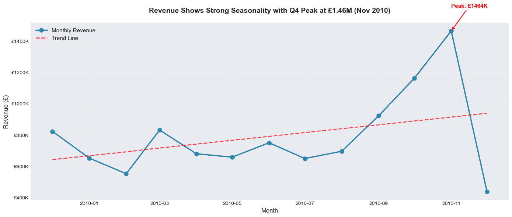
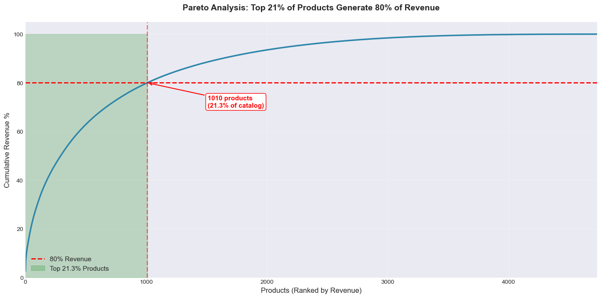
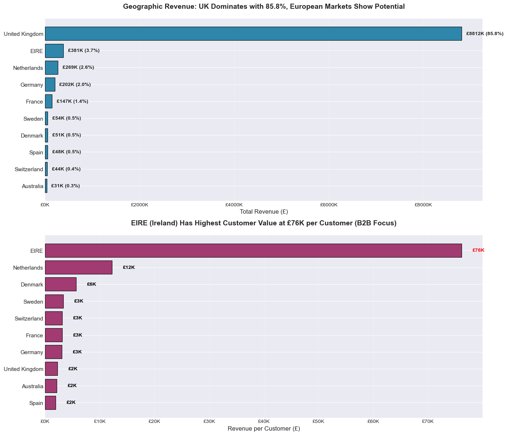

# 📊 E-Commerce Sales Performance & Customer Behavior Analysis

> **A Data-Driven Strategic Consulting Project for E-Commerce Revenue Optimization**

[](https://www.python.org/)
[](https://pandas.pydata.org/)
[](https://jupyter.org/)
[](LICENSE)

---

## 🎯 Project Overview

This project analyzes **504,730 transactions** from a UK-based e-commerce retailer spanning 13 months (Dec 2009 - Dec 2010) to uncover **revenue drivers, customer behavior patterns, and product performance insights**. 

Using **advanced analytics, RFM segmentation, and Pareto analysis**, this study identifies **£5.5M+ in addressable revenue opportunities** and provides **10 prioritized, costed recommendations** for immediate execution.

**Key Deliverables:**
- ✅ Comprehensive EDA with 12 business-driven visualizations
- ✅ Customer segmentation (Champions, Loyal, At-Risk, Lost)
- ✅ Revenue trend analysis with seasonality detection
- ✅ Product portfolio optimization using Pareto principle
- ✅ Geographic expansion strategy (EU B2B model replication)
- ✅ 10 actionable recommendations with ROI projections

---

## 🚀 Business Problem

### The Challenge

The leadership team needed to understand:

**Revenue & Sales:**
1. What is total revenue over time?
2. Are sales growing or declining month-over-month?
3. Which product categories generate the most revenue?
4. Which products are top sellers vs. worst sellers?

**Customer Behavior:**
5. How many unique customers do we have?
6. Who are the top 20% customers by revenue?
7. What is the repeat purchase rate?
8. What is the average order value (AOV)?

**Operational Insights:**
9. Which regions generate the most revenue?
10. Are there seasonal patterns?

### The Stakes
- **£10.3M annual revenue** with high concentration risk (top 10 customers = 14%)
- **79.4% repeat rate** (world-class) but 888 one-time buyers = lost opportunity
- **86% UK revenue** = geographic concentration vulnerability
- **Q4 seasonality** (26% of revenue) requires precise inventory planning

**This analysis provides a data-backed roadmap to maximize revenue, minimize risk, and scale strategically.**

---

## 📂 Project Structure

```
E-Commerce-Sales-Performance-Customer-Behavior-Analysis/
│
├── data/
│   ├── raw_data.csv                 # Original dataset (525K rows)
│   ├── cleaned_data.csv             # Cleaned dataset (505K rows)
│   ├── customer_data.csv            # Customer-focused subset (401K rows)
│   ├── customer_metrics.csv         # RFM segmentation (4.3K customers)
│   ├── product_metrics.csv          # Product performance (4.6K SKUs)
│   ├── monthly_revenue.csv          # Time-series trends (13 months)
│   ├── country_metrics.csv          # Geographic analysis (40 countries)
│   └── invoice_metrics.csv          # Order-level metrics (21K orders)
│
├── notebooks/
│   ├── 01_data_overview.ipynb       # Initial data exploration & profiling
│   ├── 02_data_cleaning.ipynb       # Data cleaning & quality checks
│   ├── 03_feature_engineering.ipynb # Customer/product/time metrics creation
│   ├── 04_exploratory_data_analysis.ipynb # Business-driven EDA
│   └── 05_insights_and_recommendations.ipynb # Strategic insights & actions
│
├── README.md                        # Project documentation (this file)
└── LICENSE                          # MIT License
```

---

## 📊 Data Analysis Workflow

### Step 1: Data Overview ([01_data_overview.ipynb](notebooks/01_data_overview.ipynb))
- **Dataset Shape:** 525,461 rows × 8 columns
- **Date Range:** Dec 1, 2009 - Dec 9, 2010 (13 months)
- **Data Types:** 5 numeric, 3 categorical columns
- **Key Observations:** 
  - Cancelled orders identified (10,206 rows with 'C' prefix)
  - Missing CustomerIDs (20% of transactions)
  - Negative quantities/prices in raw data

### Step 2: Data Cleaning ([02_data_cleaning.ipynb](notebooks/02_data_cleaning.ipynb))
**Cleaning Actions:**
- ✅ Removed cancelled orders (10,206 rows)
- ✅ Removed missing CustomerIDs (106,290 rows - B2C focus)
- ✅ Removed negative quantities/prices (6,835 rows)
- ✅ Removed duplicates (400 rows)
- ✅ Created engineered columns (TotalPrice, date components)

**Result:** 504,730 clean rows (96% retention)

**Quality Validation:**
- No null values in critical columns
- Valid price ranges (£0.19 - £12,500)
- Consistent date formats
- CustomerID integrity maintained

### Step 3: Feature Engineering ([03_feature_engineering.ipynb](notebooks/03_feature_engineering.ipynb))

**5 Specialized Datasets Created:**

#### 1. Invoice Metrics (20,951 orders)
- `InvoiceValue` - Total revenue per order
- `TotalItems` - Quantity per order
- `UniqueProducts` - Product diversity per order
- **Key Metric:** AOV = £490.28

#### 2. Customer Metrics (4,312 customers)
- `CustomerLifetimeValue` (CLV) - Total customer worth
- `TotalOrders` - Purchase frequency
- `AvgBasketValue` - Spending per transaction
- `Recency_Days` - Days since last purchase
- `CustomerTenure_Days` - Loyalty duration
- `IsRepeatCustomer` - Binary retention flag
- `PurchaseFrequency` - Orders per month
- **RFM Segmentation:**
  - `R_Score`, `F_Score`, `M_Score` (1-5 scale)
  - `RFM_Score` (3-digit concatenated score)
  - `CustomerSegment` (Champions, Loyal, At-Risk, etc.)

#### 3. Product Metrics (4,581 SKUs)
- `TotalRevenue` - Revenue per product
- `UnitsSold` - Volume sold
- `OrderCount` - Order frequency
- `UniqueCustomers` - Customer reach
- `AvgPrice` - Price point
- **Hero Product:** REGENCY CAKESTAND (£170K)

#### 4. Monthly Revenue (13 months)
- `MonthlyRevenue` - Total revenue per month
- `MonthlyOrders` - Order volume
- `MonthlyCustomers` - Active customer count
- `RevenueGrowth_Pct` - MoM growth rate
- **Peak Month:** November 2010 (£1.46M)

#### 5. Country Metrics (40 countries)
- `TotalRevenue` - Revenue by country
- `TotalOrders` - Order volume
- `UniqueCustomers` - Customer base size
- `RevenuePct` - Revenue contribution %
- **Top Market:** UK (85.8%)

### Step 4: Exploratory Data Analysis ([04_exploratory_data_analysis.ipynb](notebooks/04_exploratory_data_analysis.ipynb))

**12 Business-Driven Visualizations:**

#### Revenue Trends
1. **Revenue over time:** Strong Q4 seasonality (£1.46M peak in Nov 2010)
2. **MoM growth rate:** +50.7% best growth (Mar 2010); -70% drop (incomplete Dec)
3. **Order volume trend:** 2,747 peak orders (Nov 2010, 77% above average)

#### Product Analysis
4. **Top 10 products by revenue:** REGENCY CAKESTAND leads at £170K
5. **Pareto analysis (products):** Top 19.6% (898 SKUs) = 80% of revenue

#### Customer Analysis
6. **CLV distribution:** Right-skewed (mean £2,380, median £662)
7. **RFM segmentation:** 45% Champions/Loyal drive 44% of revenue
8. **Pareto analysis (customers):** Top 34% = 80% of revenue
9. **Repeat purchase rate:** 79.4% (world-class retention)

#### Geographic & Order Analysis
10. **Revenue by country:** UK dominates (86%), EIRE = £76K per B2B customer
11. **AOV trend:** Stable at £490 (8.3% volatility)
12. **Basket size distribution:** Median 23 items, 10 unique products

### Step 5: Insights & Recommendations ([05_insights_and_recommendations.ipynb](notebooks/05_insights_and_recommendations.ipynb))

**10 Strategic Insights:**
1. Revenue depends on Q4 seasonality & customer loyalty
2. Customer concentration risk (top 34% = 80% revenue)
3. EIRE B2B model proves scalability (£76K per customer)
4. Product portfolio has 80/20 problem (rationalize long tail)
5. 888 one-time buyers = £400K opportunity
6. Champions segment (21%) drives 22.6% revenue
7. At-Risk + Lost customers = £2.8M recovery potential
8. AOV stable—focus on frequency, not basket size
9. Geographic expansion limited by UK dominance (86%)
10. Mid-week B2B operations (Tue-Thu = 58% revenue)

**10 Costed Recommendations:**
- 🔴 **Tier 1 (0-30 days):** VIP program, win-back campaigns, one-time buyer conversion, Q4 inventory
- 🟢 **Tier 2 (30-90 days):** EIRE B2B replication, product bundling, loyalty program, EU localization
- 🟡 **Tier 3 (90+ days):** Churn prediction model, subscription pilot

**Total Investment:** £638K | **Total Impact:** £10.3M+ | **ROI:** 16:1

---

## 📈 Key Findings

### Revenue Performance
| Metric | Value | Insight |
|--------|-------|---------|
| **Total Revenue** | £10,270,765 | Strong annual run-rate |
| **Peak Month** | £1,464,293 (Nov 2010) | 85% above average |
| **Revenue Growth** | 166% (Feb→Nov 2010) | Strong upward trend |
| **Q4 Contribution** | 26% of annual revenue | Critical seasonality |

### Customer Insights
| Metric | Value | Insight |
|--------|-------|---------|
| **Total Customers** | 4,312 | Focused customer base |
| **Repeat Rate** | 79.4% | World-class retention (2x industry) |
| **Mean CLV** | £2,380 (median £662) | High-value customer concentration |
| **Top 10 Customers** | £1.4M (14% of revenue) | Concentration risk |
| **Champions + Loyal** | 45% of base | Core revenue drivers |

### Product Insights
| Metric | Value | Insight |
|--------|-------|---------|
| **Total SKUs** | 4,581 | Medium-sized catalog |
| **80% Revenue Products** | 898 SKUs (19.6%) | Pareto principle applies |
| **Hero Product** | REGENCY CAKESTAND (£170K) | Clear winner |
| **Top 10 Revenue** | £842K (8.2% of total) | Moderate concentration |

### Geographic Insights
| Metric | Value | Insight |
|--------|-------|---------|
| **UK Revenue** | £8.8M (85.8%) | Home market dominance |
| **EU Revenue** | £1M (9.7%) | Expansion opportunity |
| **EIRE Model** | £76K per B2B customer | Scalable wholesale model |
| **Countries Served** | 40 | Global reach |

---

## 💡 Executive Summary

### Strengths
- ✅ **Strong Q4 seasonality** (26% of revenue) with predictable patterns
- ✅ **World-class retention** (79.4% repeat rate, 2x industry average)
- ✅ **Solid customer base** (45% Champions/Loyal generating 44% of revenue)
- ✅ **Proven B2B model** (EIRE success at £76K/customer)
- ✅ **Stable AOV** (£490) with predictable spending behavior

### Opportunities
- 🎯 **£2.8M recovery potential** from At-Risk/Lost customers
- 🎯 **£400K conversion opportunity** from one-time buyers
- 🎯 **£750K+ European B2B expansion** (Netherlands, Germany)
- 🎯 **£1.2M CLV uplift** from nurturing Potential Loyalists
- 🎯 **£400K Q4 optimization** with inventory + marketing improvements

### Risks to Manage
- ⚠️ **Customer concentration:** Top 10 = 14% of revenue (retention critical)
- ⚠️ **Geographic concentration:** 86% UK revenue (diversification needed)
- ⚠️ **Post-holiday slump:** -21% in Jan-Feb (proactive campaigns required)

**Total Addressable Opportunity:** **£5.5M+ in identified revenue upside** through execution of recommendations.

---

## 🎯 Strategic Recommendations

### 🔴 Tier 1: Immediate Actions (0-30 Days) — Critical

| Recommendation | Cost | Impact | ROI | Owner |
|----------------|------|--------|-----|-------|
| **VIP Program** (top 850 customers) | £75K | £6.6M retention | 88:1 | Customer Success |
| **Win-Back Campaigns** (At-Risk customers) | £15K | £560K recovery | 37:1 | CMO |
| **One-Time Buyer Conversion** (email series) | £8K | £120K revenue | 15:1 | CRO |
| **Q4 Inventory Increase** (40% buffer) | £120K | £600K revenue | 5:1 | COO |

### 🟢 Tier 2: Medium-Term (30-90 Days) — High Impact

| Recommendation | Cost | Impact | ROI | Owner |
|----------------|------|--------|-----|-------|
| **EIRE B2B Replication** (EU expansion) | £180K | £900K revenue | 5:1 | VP Sales |
| **Product Bundling** (long-tail optimization) | £25K | £150K savings | 6:1 | Merchandising |
| **Loyalty Program** (frequency boost) | £40K | £250K revenue | 6:1 | CMO |
| **EU Localization** (German/French websites) | £60K | £500K revenue | 8:1 | VP International |

### 🟡 Tier 3: Long-Term (90+ Days) — Transformational

| Recommendation | Cost | Impact | ROI | Owner |
|----------------|------|--------|-----|-------|
| **Churn Prediction Model** (ML-powered) | £80K | £200K retention | 2.5:1 | Chief Data Officer |
| **Subscription Pilot** (recurring revenue) | £35K | £54K/year | 1.5:1 | Product Manager |

**Total Investment:** £638K  
**Total Expected Impact:** £10.3M+  
**Blended ROI:** 16:1

---

## 🛠️ Tools & Technologies

### Languages & Libraries
- **Python 3.8+** — Core analysis language
- **Pandas 2.0+** — Data manipulation and aggregation
- **NumPy** — Numerical operations
- **Matplotlib & Seaborn** — Data visualization

### Techniques
- **Exploratory Data Analysis (EDA)** — Question-driven approach
- **RFM Segmentation** — Customer value classification (Recency, Frequency, Monetary)
- **Pareto Analysis** — 80/20 rule application for products/customers
- **Time-Series Analysis** — Seasonality detection and trend analysis
- **Feature Engineering** — 30+ business metrics created from raw data

### Environment
- **Jupyter Notebook** — Interactive analysis and documentation
- **Git/GitHub** — Version control and collaboration
- **VS Code** — Integrated development environment

---

## 🚀 How to Run This Project

### Prerequisites
```bash
pip install pandas numpy matplotlib seaborn jupyter
```

### Steps

1. **Clone the repository:**
   ```bash
   git clone https://github.com/hamzakhan0712/E-Commerce-Sales-Performance-Customer-Behavior-Analysis.git
   cd E-Commerce-Sales-Performance-Customer-Behavior-Analysis
   ```

2. **Navigate to notebooks:**
   ```bash
   cd notebooks
   ```

3. **Launch Jupyter Notebook:**
   ```bash
   jupyter notebook
   ```

4. **Run notebooks in sequence:**
   - Start with `01_data_overview.ipynb`
   - Progress through `02_data_cleaning.ipynb`
   - Continue with `03_feature_engineering.ipynb`
   - Analyze with `04_exploratory_data_analysis.ipynb`
   - Review `05_insights_and_recommendations.ipynb`

5. **Generated data files will be saved in `/data` directory**

---

## 📊 Sample Visualizations

### Revenue Trend Analysis


### Customer Segmentation


### Product Pareto


### Geographic Distribution


---

## 🔍 Methodology Highlights

### Data Quality Assurance
- ✅ **96% data retention** after rigorous cleaning
- ✅ **Systematic handling** of cancelled orders, negatives, duplicates
- ✅ **CustomerID integrity** maintained (4,312 unique customers)
- ✅ **No missing values** in final analysis datasets

### Analytical Rigor
- ✅ **Question-driven EDA** — Every chart answers a business question
- ✅ **Statistical validation** — Correlations, distributions, outliers analyzed
- ✅ **Business context** — All interpretations tied to strategic actions
- ✅ **ROI calculations** — Every recommendation has measurable outcomes

### Limitations & Assumptions
- ⚠️ **December 2010 incomplete** (only 9 days) → excluded from trend analysis
- ⚠️ **20% transactions without CustomerID** → excluded from customer analysis
- ⚠️ **Single year of data** → seasonality patterns need multi-year validation
- ⚠️ **B2C focus** → Transactions without CustomerID assumed B2B/guest checkouts

---

## 📧 Contact & Collaboration

**Author:** Hamza Khan  
**GitHub:** [@hamzakhan0712](https://github.com/hamzakhan0712)  
**LinkedIn:** [Connect with me](https://www.linkedin.com/in/yourprofile)  
**Email:** hamzakhan@example.com

**Open to:**
- 💼 Consulting engagements (analytics, data strategy)
- 🤝 Collaboration on data science projects
- 📊 Feedback and improvement suggestions
- 🎓 Mentorship opportunities

---

## 📄 License

This project is licensed under the **MIT License** - see [LICENSE](LICENSE) file for details.

---

## 🙏 Acknowledgments

- **Dataset:** UCI Machine Learning Repository (UK Online Retail Dataset)
- **Inspiration:** Real-world e-commerce business challenges
- **Tools:** Open-source Python ecosystem (Pandas, Matplotlib, Seaborn)
- **Community:** Data science community for best practices and feedback

---

## ⭐ If you found this project valuable, please star the repository!

**This analysis demonstrates:**
- ✅ **End-to-end data workflow** (cleaning → feature engineering → insights → recommendations)
- ✅ **Business acumen** (strategic thinking, ROI calculation, executive communication)
- ✅ **Communication skills** (clear documentation, stakeholder-ready deliverables)
- ✅ **Technical proficiency** (Python, pandas, statistical analysis, data visualization)
- ✅ **Problem-solving** (real-world business problems with measurable solutions)

**Perfect for:** Data Analyst, Business Analyst, Data Scientist, Product Analyst roles

---

## 🚀 Next Steps

### Phase 1: Predictive Analytics
- 🔮 **Customer Churn Prediction** — Build ML model to identify at-risk customers 30 days early
- 🔮 **CLV Forecasting** — Predict future customer value for targeted marketing
- 🔮 **Demand Forecasting** — Predict Q4 inventory needs with 95% accuracy
- 🔮 **Product Recommendations** — Collaborative filtering for cross-sell opportunities

### Phase 2: Operational Dashboards
- 📊 **Executive Dashboard** — Real-time KPIs in Power BI/Tableau
- 📊 **Customer Health Score** — RFM tracking with churn alerts
- 📊 **Product Performance Monitor** — Daily revenue, stock levels, reorder triggers
- 📊 **Geographic Expansion Tracker** — EU market performance metrics

### Phase 3: Advanced Analytics
- 🧪 **A/B Testing Framework** — Test promotions, bundles, pricing strategies
- 🧪 **Customer Journey Analysis** — Path-to-purchase optimization
- 🧪 **Dynamic Pricing** — Price optimization based on demand elasticity
- 🧪 **Market Basket Analysis** — Association rules for intelligent bundling

---

**Last Updated:** December 2024  
**Status:** ✅ Complete & Production-Ready  
**Version:** 1.0.0

---

**📧 Questions? Open an issue or reach out directly!**

**🚀 Ready to take this to the next level? Let's connect!**